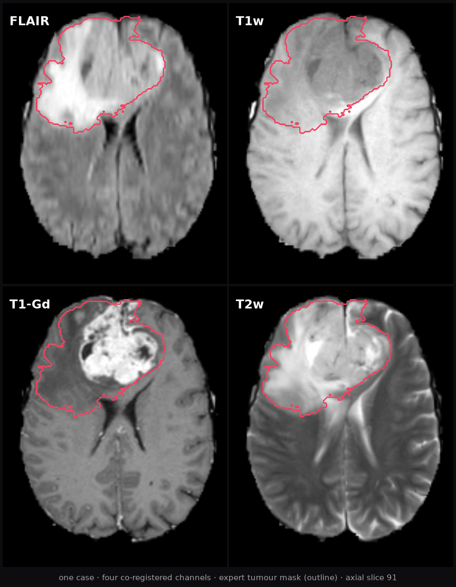

# Agentic Medical AI Lab — brain tumour segmentation

**AI in Life Science Summer School · Aarhus, 17–18 August**
Kim Beuschau Mouridsen, Aarhus University

You will build, evaluate and stress-test a medical image segmentation model —
using **Claude Code** to write the software, and your own judgement to decide
whether the result can be believed.

You do not need to be a programmer. You need to be a good scientist.



---

## Setup — we do this together on Monday morning

**There is nothing to prepare in advance.** Bring a laptop, and make sure you
can log in to a Claude account that includes Claude Code — **Pro, Max or Team**;
a free claude.ai login is not enough. (Prefer a different coding agent, or want
a free one? See step 1.) We set everything up in the first session.

When we start, in this order:

**1. Install Claude Code and log in.**
[code.claude.com/docs](https://code.claude.com/docs/en/quickstart) has the
one-line installer for each platform.
*(Windows: also install [Git for Windows](https://git-scm.com/download/win) —
it gives Claude Code a proper shell.)*

> **Another agent is fine.** We developed and tested the exercises with Claude
> Code, so that is what we recommend and what we can help you with fastest. But
> nothing here depends on it — use any coding agent you like, such as OpenAI's
> Codex, or [OpenCode](https://opencode.ai) if you want a free alternative.

**2. Get Python 3.11 or 3.12.**
Either install it yourself from [python.org](https://www.python.org/downloads/),
or simply ask Claude Code to do it for you:

> *Check whether I have Python 3.11 or 3.12. If not, install it.*

**3. Get this repository.**
Either run:

```bash
git clone https://github.com/kimmouridsen-cloud/agentic-medical-ai-lab
cd agentic-medical-ai-lab
python verify.py
```

or, if that line means nothing to you, ask Claude Code:

> *Clone https://github.com/kimmouridsen-cloud/agentic-medical-ai-lab, then run
> verify.py inside it and fix whatever it complains about.*

`verify.py` prints a checklist and ends with **ALL GOOD** when you are ready.
If it reports something missing, hand the output to Claude Code and let it sort
it out — installing packages is its job, not yours.

> **Stuck for 15 minutes?** Don't lose the morning to it. On GitHub click
> **Code → Codespaces → Create codespace** — the whole environment, data
> included, in your browser. You lose nothing. *(A free GitHub account is all
> this needs.)*

---

## What's here

```
data/cases/       60 cases · 4 MRI channels · expert tumour masks
exercises.pdf     the seven exercises, E1–E7 — one page each
verify.py         environment check — run this first
```

There is no solution code here, by design. Everything you produce is something
you build by directing Claude — that is the whole point of the two days.

---

## The data

60 brain MRI cases (`case_001` … `case_060`), each with four co-registered
channels and an expert-drawn tumour mask:

| Channel | |
|---|---|
| **FLAIR** | fluid-attenuated — tumour and oedema appear bright |
| **T1w** | anatomy |
| **T1-Gd** | after contrast — active tumour enhances |
| **T2w** | tumour and oedema bright |

Volumes are `240 × 240 × 155`, 1 mm isotropic, skull-stripped and
co-registered. Labels are 1 = oedema, 2 = non-enhancing core, 3 = enhancing
tumour; we treat **any label > 0 as "tumour"**.

### Which cases to work on

| Cohort | Cases | |
|---|---|---|
| **Standard** — `tier_standard.txt` | 60 | **Use this one.** Develop on it and report on it. |
| **Tiny** — `tier_tiny.txt` | 15 | Only if your laptop is too slow to work on all 60. |

Work on all 60 unless compute forces you down to 15 — and if it does, say so
whenever you quote a number, because the number depends on it. Sample size
decides what you are entitled to conclude.

A larger 424-case set exists for anyone who wants to push further — ask.

The cases carry neutral identifiers on purpose: for these two days we want you
reasoning from the images in front of you, not from published results for a
named benchmark. The source and citation are therefore held back until the end
of the lab, and published here with the rest of the course material afterwards.
The data is CC-BY-SA 4.0; code and teaching material are MIT.

---

## Ground rules for the two days

1. **Ask Claude for its plan before it writes files.**
2. **Never accept a number you have not seen a figure for.**
3. **Decide what a good result looks like before you produce one.**
4. **Report what you found, not what you hoped for.**

These are the whole course, compressed.
